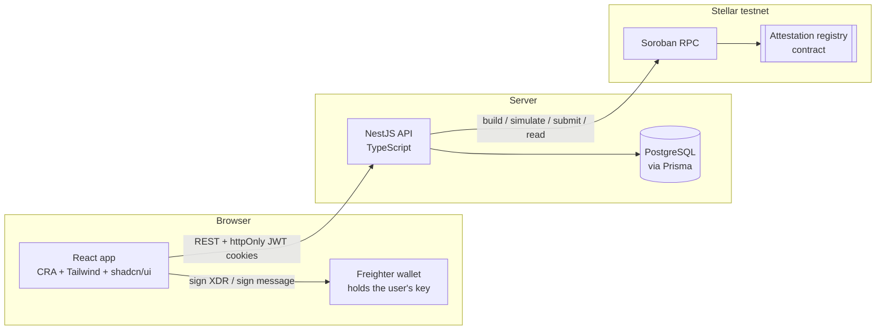
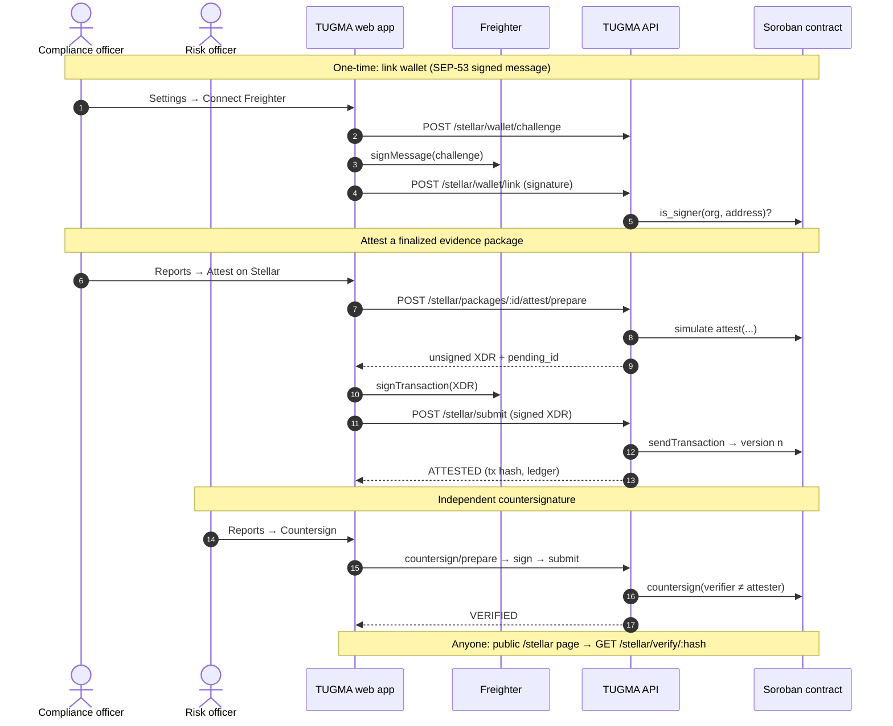

# TUGMA — Compliance You Can Prove

[](https://github.com/christopher-icalla/tugma/actions/workflows/ci.yml)
[](LICENSE)
[](https://stellar.expert/explorer/testnet/contract/CC734HZAIWGKKFFD5CZNY73EC3YJJZYDK6IJQQLCZUOSD34U3SY33ZTH)

**Continuous Payment Control Intelligence for regulated payment operators.**

TUGMA continuously tests actual payment operations against defined regulatory and organizational controls, identifies exceptions, connects them to remediation and evidence, and produces evidence packages whose integrity anyone can verify on Stellar.

> **Detect. Prevent. Prove.**

Website: [tugmaapp.com](https://tugmaapp.com)

---

## Contents

- [The problem](#the-problem)
- [How TUGMA works](#how-tugma-works)
- [Features](#features)
- [Architecture](#architecture)
- [On-chain attestation flow](#on-chain-attestation-flow)
- [Tech stack](#tech-stack)
- [Repository layout](#repository-layout)
- [Getting started](#getting-started)
- [Setting up Stellar signing](#setting-up-stellar-signing)
- [Configuration](#configuration)
- [Controls and the demo dataset](#controls-and-the-demo-dataset)
- [Roles and permissions](#roles-and-permissions)
- [API reference](#api-reference)
- [Testing and CI](#testing-and-ci)
- [Security model](#security-model)
- [Disclaimer](#disclaimer)
- [License](#license)

---

## The problem

Regulated payment operators have policies, regulatory requirements, operational controls, transaction data, approvals, reconciliations, and evidence scattered across different systems and workflows.

The difficult question is not only:

> "Do we have a compliance policy?"

It is:

> **"Did the actual payment operation follow the required control, and can we prove what happened?"**

TUGMA connects the requirement to the actual payment activity and creates a traceable evidence chain.

---

## How TUGMA works

```text
REGULATION                  BSP Manual of Regulations for Payment Systems, AMLC issuances
    ↓
REQUIREMENT                 e.g. BSP-PS-04 Settlement Integrity and Reconciliation
    ↓
CONTROL                     e.g. CTRL-005 Settlement Reconciliation
    ↓
PAYMENT ACTIVITY            10,000 synthetic transactions
    ↓
AUTOMATED CONTROL TEST      PASS / FAIL / WARNING / NOT_TESTABLE per record
    ↓
EXCEPTION                   explainable: expected vs actual vs variance vs tolerance
    ↓
REMEDIATION                 owner, due date, completion note
    ↓
EVIDENCE                    content-hashed (SHA-256) records
    ↓
INDEPENDENT VERIFICATION    verifier ≠ resolver (segregation of duties)
    ↓
EVIDENCE PACKAGE            canonical manifest for a reporting period
    ↓
SHA-256 INTEGRITY PROOF     same inputs → same hash
    ↓
STELLAR ATTESTATION         hash anchored by one signer, countersigned by another
```

A worked example ships with the demo data. Transaction **TX-847291** was processed for PHP 10,000.00 but settled at PHP 9,500.00. CTRL-005 flags a PHP 500.00 variance against a 0.01 PHP tolerance, which raises exception `EXC-CTRL-005-TX-847291`. The exception then moves through review, remediation with attached evidence, and independent verification. It lands in the Q1 evidence package, and that package's hash is attested on Stellar.

---

## Features

- **Regulatory intelligence.** Official requirements are kept separate from TUGMA's interpretation and from the operational control, so each layer is traceable to its source document.
- **Deterministic control engine.** Five controls run against real transaction fields. Runs are append-only, and re-running never duplicates exceptions or resets their workflow state.
- **Explainable exceptions.** Every failure records its check, expected value, actual value, variance and tolerance.
- **Five-state workflow.** `OPEN → IN_REVIEW → REMEDIATION → RESOLVED → VERIFIED`. An exception can't be resolved without evidence and a completed remediation, and the verifier must be a different person from the resolver.
- **Evidence Center.** Every evidence record carries a SHA-256 content hash, and completeness is scored per exception and per control.
- **Evidence packages.** A canonical, sorted-key JSON manifest for a period is hashed with SHA-256. Regenerating the same period reproduces the same hash.
- **On-chain attestation (Soroban).** Users sign with their own Freighter wallet: one authorized signer attests the package hash and a different one countersigns. Versions are append-only, and anyone can look up a hash on the public `/stellar` page.
- **Append-only audit trail.** Every write is logged, and no route exists to edit or delete audit entries.
- **Role-based access control.** Seven roles, enforced on the server and mirrored in the UI.

---

## Architecture



The API **never holds a Stellar secret key**. It builds and simulates every contract call, hands the unsigned transaction to the browser, and Freighter signs it. The API then checks that the signed envelope is byte-for-byte the transaction it prepared, submits it, and records the confirmed result.

---

## On-chain attestation flow



Segregation of duties is enforced **twice**. The API rejects a countersignature from the user who attested, and the contract rejects one from the attesting wallet (`SelfVerification`).

---

## Tech stack

| Layer | Technology |
|---|---|
| Frontend | React 19, Create React App + CRACO, Tailwind CSS, shadcn/ui (Radix), lucide-react, sonner |
| Wallet | [Freighter](https://www.freighter.app/) via `@stellar/freighter-api` |
| Backend | NestJS 11, TypeScript 5, Express, Zod validation |
| Database | PostgreSQL 16 (14+ works), Prisma ORM and migrations |
| Auth | bcrypt password hashes, HS256 JWT access (15 min) and refresh (7 days) tokens in httpOnly cookies, token-version revocation, login lockout |
| Blockchain | Stellar Soroban smart contract in Rust (`soroban-sdk`), `@stellar/stellar-sdk` for RPC |
| Testing | Jest + Supertest (API e2e against Postgres), Rust unit tests for the contract |
| CI / Ops | GitHub Actions, Docker, Docker Compose |

---

## Repository layout

```text
.
├── backend/                     NestJS API
│   ├── prisma/                  schema.prisma + SQL migrations
│   ├── src/
│   │   ├── auth/                login, refresh, password reset, RBAC guard, permission matrix
│   │   ├── api/                 dashboard, controls, transactions, exceptions, evidence, packages
│   │   ├── engine/              deterministic control engine
│   │   ├── seed/                reference data + reproducible 10k-transaction generator
│   │   ├── stellar/             Soroban client + attestation workflow (prepare / submit / sync / verify)
│   │   └── main.ts
│   ├── test/                    e2e suite + in-memory contract stand-in
│   └── Dockerfile
├── frontend/                    React app (public site + authenticated control center)
│   └── src/
│       ├── lib/stellar.js       Freighter helpers (link wallet, sign & submit)
│       ├── components/app/      AttestationPanel, StellarWallet, shared UI
│       └── pages/               public/, auth/, app/
├── contracts/                   Soroban attestation registry (Rust)
├── memory/PRD.md                product requirements
├── docker-compose.yml           Postgres + API
└── .github/workflows/ci.yml     backend, frontend and contract pipelines
```

---

## Getting started

### Prerequisites

- Node.js **22.12+**
- PostgreSQL **14+** (or Docker)
- Yarn 1 through Corepack (`corepack enable`) for the frontend
- Rust + `wasm32v1-none` target and the [Stellar CLI](https://developers.stellar.org/docs/tools/cli), only if you're building or deploying the contract
- [Freighter](https://www.freighter.app/), only if you're signing attestations

### 1. Configure the API

```sh
cp backend/.env.example backend/.env
# Set JWT_SECRET, ADMIN_EMAIL, ADMIN_PASSWORD, DEMO_USER_PASSWORD (and DATABASE_URL if not using Docker)
```

### 2a. Run with Docker Compose

```sh
POSTGRES_PASSWORD=$(openssl rand -hex 16) docker compose up --build   # Postgres + API on 127.0.0.1
```

### 2b. …or run the API directly

```sh
cd backend
npm install
npx prisma migrate deploy         # create tables
npm run start:dev                 # http://localhost:8001 (watch mode)
```

On first boot the API seeds the organization, the regulatory sources, the controls and the users, generates the 10,000-transaction dataset, and runs the control engine. Every step is idempotent, so restarting is safe.

### 3. Run the web app

```sh
cd frontend
corepack enable
yarn install
echo "REACT_APP_BACKEND_URL=http://localhost:8001" > .env
yarn start                        # http://localhost:3000
```

### Demo accounts

| Email | Role | Password |
|---|---|---|
| `ADMIN_EMAIL` from `.env` | ADMIN | `ADMIN_PASSWORD` |
| `compliance@tugmademo.ph` | COMPLIANCE | `DEMO_USER_PASSWORD` |
| `risk@tugmademo.ph` | RISK | `DEMO_USER_PASSWORD` |
| `ops@tugmademo.ph` | PAYMENT_OPS | `DEMO_USER_PASSWORD` |
| `finance@tugmademo.ph` | FINANCE | `DEMO_USER_PASSWORD` |
| `auditor@tugmademo.ph` | AUDITOR | `DEMO_USER_PASSWORD` |
| `viewer@tugmademo.ph` | VIEWER | `DEMO_USER_PASSWORD` |

---

## Setting up Stellar signing

The API defaults to the TUGMA registry already deployed on testnet:

| | |
|---|---|
| Contract ID | `CC734HZAIWGKKFFD5CZNY73EC3YJJZYDK6IJQQLCZUOSD34U3SY33ZTH` |
| Network | Stellar Testnet |
| Organization key | `org-tugma-demo-psp` |
| Explorer | [stellar.expert](https://stellar.expert/explorer/testnet/contract/CC734HZAIWGKKFFD5CZNY73EC3YJJZYDK6IJQQLCZUOSD34U3SY33ZTH) · [Stellar Lab](https://lab.stellar.org/r/testnet/contract/CC734HZAIWGKKFFD5CZNY73EC3YJJZYDK6IJQQLCZUOSD34U3SY33ZTH) |

To attest from the app:

1. **Install Freighter** and switch it to **Testnet**.
2. **Fund the account** with Friendbot: `https://friendbot.stellar.org?addr=<G...>`.
3. **Link the wallet.** Sign in as a COMPLIANCE, RISK or ADMIN user, open **Settings → Stellar Wallet → Connect Freighter**, and approve the one-time message signature.
4. **Authorize it on-chain.** The contract admin runs:

   ```sh
   stellar contract invoke --id CC734HZAIWGKKFFD5CZNY73EC3YJJZYDK6IJQQLCZUOSD34U3SY33ZTH \
     --source tugma-admin --network testnet -- \
     add_signer --org org-tugma-demo-psp --signer <G... address>
   ```

   Settings shows **Authorized signer on-chain** once this is done.
5. **Attest.** On **Reports**, generate a package for a period, then click **Attest on Stellar** and approve in Freighter.
6. **Countersign.** Sign in as a *different* authorized user (for example, RISK attests and COMPLIANCE countersigns) and click **Countersign**.
7. **Verify.** Anyone can paste the package hash on the public **/stellar** page.

If a package is regenerated after new evidence arrives, its hash changes. Reports then shows the attestation as stale and offers **Re-attest new hash**, which appends version *n+1*; earlier versions remain on-chain. **Sync from chain** rebuilds local records from contract state, which covers attestations made with the CLI.

Contract build, test and deploy instructions are in [`contracts/README.md`](contracts/README.md). To use your own deployment, set `STELLAR_CONTRACT_ID`.

---

## Configuration

All API settings are environment variables, validated at startup (see [`backend/.env.example`](backend/.env.example)).

| Variable | Required | Default | Purpose |
|---|---|---|---|
| `DATABASE_URL` | yes | — | PostgreSQL connection string |
| `JWT_SECRET` | yes | — | HS256 signing secret (≥ 32 chars; use 48+ random bytes) |
| `ADMIN_EMAIL` / `ADMIN_PASSWORD` | yes | — | Seeded administrator (password ≥ 12 chars) |
| `DEMO_USER_PASSWORD` | yes | — | Password for the six demo role users (≥ 12 chars) |
| `PORT` | | `8001` | HTTP port |
| `FRONTEND_URL` | | `http://localhost:3000` | CORS origin(s), comma-separated; also the base of password-reset links |
| `COOKIE_SECURE` | | `true` | Secure cookies. Set `false` only for plain-HTTP non-localhost setups |
| `COOKIE_SAMESITE` | | `lax` | `lax` when web app and API share a site (e.g. `tugmaapp.com` + `api.tugmaapp.com`); `none` only for different sites |
| `TRUST_PROXY` | | `0` | Number of reverse proxies in front of the API. Set `1` behind a load balancer so rate limits see real client IPs |
| `EMAIL_API_URL` / `EMAIL_API_KEY` / `EMAIL_FROM_NAME` | | — | Password-reset email provider; without it, the link is logged on localhost |
| `STELLAR_NETWORK` | | `TESTNET` | Label shown in the UI |
| `STELLAR_RPC_URL` | | `https://soroban-testnet.stellar.org` | Soroban RPC endpoint |
| `STELLAR_NETWORK_PASSPHRASE` | | `Test SDF Network ; September 2015` | Network passphrase |
| `STELLAR_CONTRACT_ID` | | TUGMA testnet registry | Attestation contract |
| `STELLAR_EXPLORER_URL` | | `https://stellar.expert/explorer/testnet` | Explorer links in the UI |

Frontend: `REACT_APP_BACKEND_URL` is the API origin.

---

## Controls and the demo dataset

| Code | Control | Requirement | Logic | Latest result |
|---|---|---|---|---|
| CTRL-001 | Critical Third-Party Oversight | BSP-ITRM-01 | Critical vendors must have `CURRENT` due diligence | 1 warning (4 vendors) |
| CTRL-002 | IT Risk Control Evidence | BSP-ITRM-02 | Approval recorded; initiator ≠ approver | 30 fail |
| CTRL-003 | AML/CTPF Control Evidence | AMLC-CTF-01 | Program evidence for the period | Not testable (manual) |
| CTRL-004 | Merchant / End-User Protection | BSP-EUP-01 | Supporting evidence per transaction | 10 warnings |
| CTRL-005 | Settlement Reconciliation | BSP-PS-04 | Settlement and payout variance > 0.01 PHP; duplicate idempotency keys | 82 fail, 150 not testable |

The dataset is **synthetic and reproducible**. It has 10,000 transactions across 150 merchants, generated from a fixed seed, with an exact set of injected defects: 60 settlement discrepancies, 7 payout breaches, 15 duplicates, 25 missing approvals, 5 segregation-of-duty breaches, 10 missing-evidence cases, and 150 unsettled transactions. The engine *detects* these defects from the transaction fields; it never reads them back as answers. The result is **122 exceptions, 72 of them high severity**.

---

## Roles and permissions

| Permission | ADMIN | COMPLIANCE | RISK | PAYMENT_OPS | FINANCE | AUDITOR | VIEWER |
|---|:-:|:-:|:-:|:-:|:-:|:-:|:-:|
| Read dashboards, controls, transactions, exceptions, evidence, reports | ✓ | ✓ | ✓ | ✓ | ✓ | ✓ | ✓ |
| Assign, transition, remediate, comment on exceptions; add evidence | ✓ | ✓ | ✓ | ✓ | ✓ | | |
| Verify exceptions (≠ resolver) | ✓ | ✓ | ✓ | | | | |
| Run controls | ✓ | ✓ | ✓ | ✓ | | | |
| Generate evidence packages | ✓ | ✓ | | | | | |
| Attest a package on Stellar | ✓ | ✓ | | | | | |
| Countersign an attestation (≠ attester) | ✓ | ✓ | ✓ | | | | |
| Read audit trail | ✓ | ✓ | | | | ✓ | |

The server is the source of truth ([`backend/src/auth/permissions.ts`](backend/src/auth/permissions.ts)), and the UI mirrors it in [`frontend/src/lib/perms.js`](frontend/src/lib/perms.js) only to hide controls a role can't use.

---

## API reference

Every route is under `/api`. Errors are returned as `{ "detail": "..." }`. Routes marked 🌐 are public; all others need a session.

| Method | Path | Notes |
|---|---|---|
| GET | `/health` 🌐 | Liveness + DB check |
| POST | `/auth/login` 🌐 · `/auth/logout` · `/auth/refresh` 🌐 | httpOnly cookie session |
| GET | `/auth/me` | Current user |
| POST | `/auth/forgot-password` 🌐 · `/auth/reset-password` 🌐 | Single-use, 1-hour tokens; rate limited |
| GET | `/organization` · `/dashboard/summary` · `/regulatory/sources` | |
| GET | `/controls` · `/controls/:code` | Latest run per control, run history |
| POST | `/controls/run` | Re-runs the engine (append-only) |
| GET | `/transactions` · `/transactions/:id` | `page`, `page_size ≤ 100`, `search`, `control`, `test_status`, `payment_status`, `risk_status`, `has_exception`, `sort`, `direction` |
| GET | `/exceptions` · `/exceptions/:code` · `/exceptions/:code/chain` | Facets, explanation, evidence chain |
| POST | `/exceptions/:code/assign` · `/transition` · `/remediation` · `/comment` | Workflow |
| GET / POST | `/evidence` · `/evidence/completeness` | Content-hashed evidence |
| POST | `/evidence-packages/generate` | `{ name?, period_start, period_end }` → canonical SHA-256 |
| GET | `/evidence-packages` · `/evidence-packages/:id` · `/reports` | Includes `stellar` status and `attestations` versions |
| GET | `/audit-logs` | `entity_id`, `limit ≤ 500` |
| GET | `/stellar/config` 🌐 | Network, contract, explorer |
| GET | `/stellar/verify/:hash` 🌐 | On-chain lookup of a package hash |
| GET / DELETE | `/stellar/wallet` | Linked wallet + on-chain signer status / unlink |
| POST | `/stellar/wallet/challenge` · `/stellar/wallet/link` | SEP-53 ownership proof |
| POST | `/stellar/packages/:id/attest/prepare` · `/countersign/prepare` | Returns unsigned XDR + `pending_id` |
| POST | `/stellar/submit` | `{ pending_id, signed_xdr }` → submitted and confirmed |
| POST | `/stellar/packages/:id/sync` | Rebuild records from contract state |
| GET | `/stellar/attestations` | All on-chain versions for the organization |

---

## Testing and CI

```sh
# API: needs a Postgres database whose name contains "test" (it is cleared before the run)
cd backend
TEST_DATABASE_URL=postgresql://localhost:5432/tugma_test npm test

# Contract
cd contracts && cargo test

# Web app
cd frontend && CI=true yarn build
```

The API e2e suite boots the full NestJS app against Postgres. It checks the engine numbers, the exception workflow, the 403 role gates, package hash reproducibility, and the complete **link → attest → countersign → verify → sync** flow. That flow runs against an in-memory stand-in for the contract that enforces the contract's own rules, so CI doesn't depend on testnet. The same flow has been run end to end against real Stellar testnet.

[GitHub Actions](.github/workflows/ci.yml) runs three jobs on every push and pull request: **backend** (typecheck, tests against a Postgres service, build), **frontend** (production build with lint warnings as errors), and **contracts** (`cargo test` plus a wasm build uploaded as an artifact).

---

## Security model

- **No custodial keys.** Stellar secrets live only in users' wallets. The API prepares transactions and verifies that the signed envelope hash matches what it prepared, so a client can't swap in a different call.
- **Wallet ownership is proven** with a SEP-53 signed challenge that expires after 5 minutes. A Stellar account can be linked to only one user.
- **Data stays off-chain.** Only the 32-byte SHA-256 of a package manifest goes on-chain.
- **Sessions** use httpOnly, Secure, `SameSite=Lax` cookies. Changing a password increments `token_version`, which revokes existing sessions. Five failed logins lock an IP+email pair for 15 minutes, and login takes the same time whether or not the email exists.
- **CSRF**: besides SameSite cookies, the API rejects state-changing requests whose `Origin` isn't the web app, and it accepts JSON bodies only (≤ 100 KB), so HTML forms on other sites can't post to it.
- **Rate limits** (per IP): 300 requests/min overall; 10/min on login, refresh and password reset; 20/min on wallet linking and transaction building; 30/min on the public hash lookup.
- **Headers**: helmet sets HSTS, `nosniff`, frame protection and related headers; `X-Powered-By` is removed. Errors never include stack traces.
- **Secrets**: the API won't start with placeholder or previously leaked passwords, or a JWT secret shorter than 32 characters.
- **Password reset** returns the same response whether or not the email exists, and its tokens are single-use, expire after one hour, and are stored only as hashes.
- **The audit trail is append-only**, with no update or delete routes.
- **Money** is stored as `NUMERIC(14,2)` and compared with decimal arithmetic.

---

## Disclaimer

TUGMA provides regulatory intelligence and control-mapping software. It does not provide legal advice, certify compliance, or represent that an organization is approved or certified by any government authority. TUGMA is not an AML transaction-monitoring replacement, a payment processor, a bank, or a regulator. All data in this repository is synthetic demonstration data. The Stellar integration runs on **testnet** and does not imply mainnet production readiness.

---

## License

[MIT](LICENSE) © 2026 Christopher Icalla
